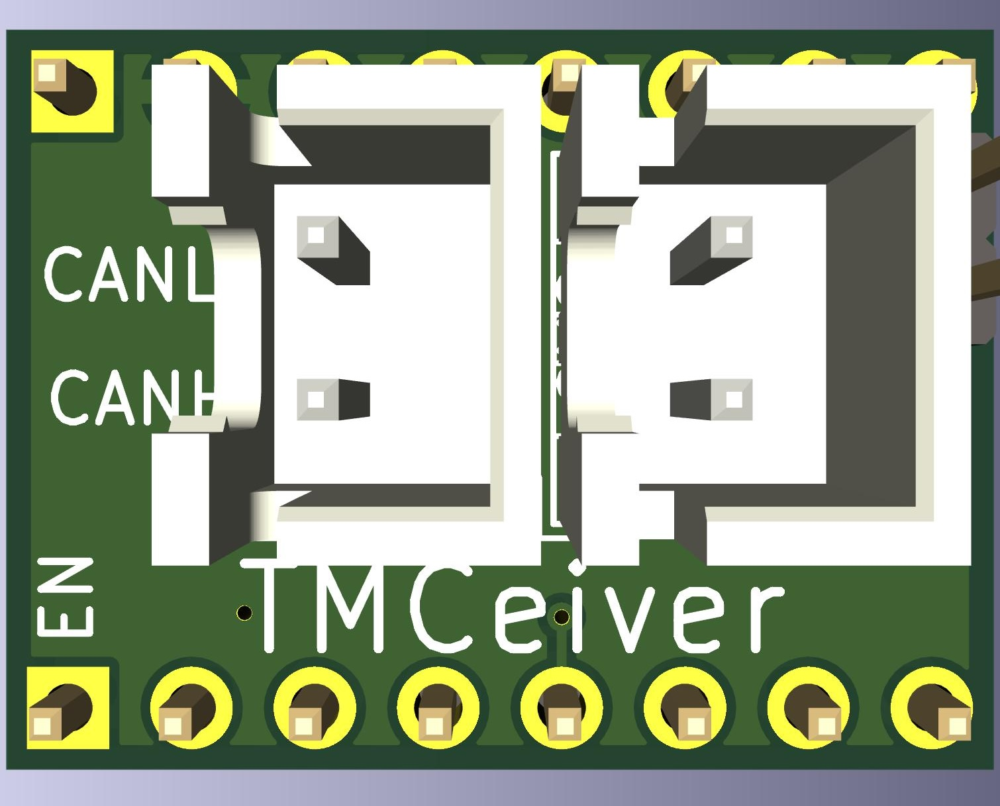
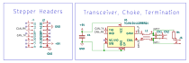

# TMCeiver

A drop in CAN transceiver for Robin Nano V3. 

TMCeiver utilizes a spare stepper slot on Robin Nano V3. 

## Features
- CANFD support (in hardware, not yet supported in Klipper)
- Excellent reliability--no CAN retransmits in several months of testing
- Jumperable 120 ohm termination resistor
- Less cabling to crimp

## Installation

Start with power off.

1. Remove the stepper driver from the slot you want to use.
2. Make sure the steppers are jumpered to run at 5v.
3. Use jumpers to jump the MISO and SCK pins to the TMCeiver. MISO and SCK are the first and third pins from the mcu side of the stepper slot. If you're not sure, you can jumper the entire row (all four pins). 
4. Insert TMCeiver into the slot, aligning the EN silkscreen with the EN slot on the board. If you get it backwards, nothing will be damaged, but it won't work.
5. Connect the CAN bus to the JST XH connector. 
6. Terminate the CAN bus by placing a jumper on the pins labeled `TERM`.
7. You can connect a second CAN device to the other JST XH connector, in which case you should remove the jumper from the `TERM` pins and terminate the bus at the last device.
8. Compile firmware and flash your board, probably with [Katapult](https://github.com/arksine/katapult) first, and then with [Klipper](https://github.com/klipper3d/klipper). If you're connecting to the CAN bus with USB via the Robin Nano V3, you'll need to compile in CAN bus bridge mode. Use pins 'PD0/PD1' for the CAN bus.

## Schematic

## Acquisition

Use the files in [production_files](jlcpcb/production_files/) directory to order the PCB from your favorite board house. If you're trying to lower costs, you can opt for assembly on the bottom side only, and hand solder the top side components.

There's also a couple available from my first run [here](https://octule.etsy.com).